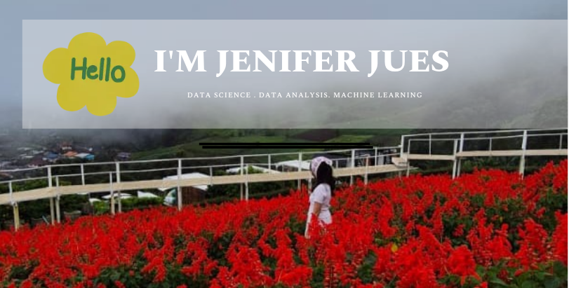

# Hi there 👋 I'm Jennie  

Welcome to my GitHub profile!  

---

## 👩🏻‍💻 About Me

- 🔭 I’m currently working on data analytics & machine learning projects  
- 🌱 I’m currently learning advanced forecasting & model optimization
- 👨🏻‍🎓 I’m currently studying Master of Data Science at University of Malaya, Malaysia
- 🧬 I have a Bachelor Degree in Biotechnology
- 🧭 I like to travel and explore new things (Data and tools) 😜
- 🏞️ I love nature and flowers
- 👯 I’m looking to collaborate on data-driven projects and research  
- 🤔 I’m looking for help with improving ML deployment & cloud integration  
- 📫 How to reach me: jeniferjues@gmail.com  
- ⚡ Fun fact: I enjoy turning messy datasets into meaningful insights ✨  

---

## 🛠 Tech Tools

  
  
  
  
  

---

## 📊 Featured Interests
- 📈 Data Analytics  
- 🤖 Machine Learning  
- 📊 Data Visualization 

---

## 🤝 Connect With Me

  
  

---

⭐️ Thanks for visiting my profile!
